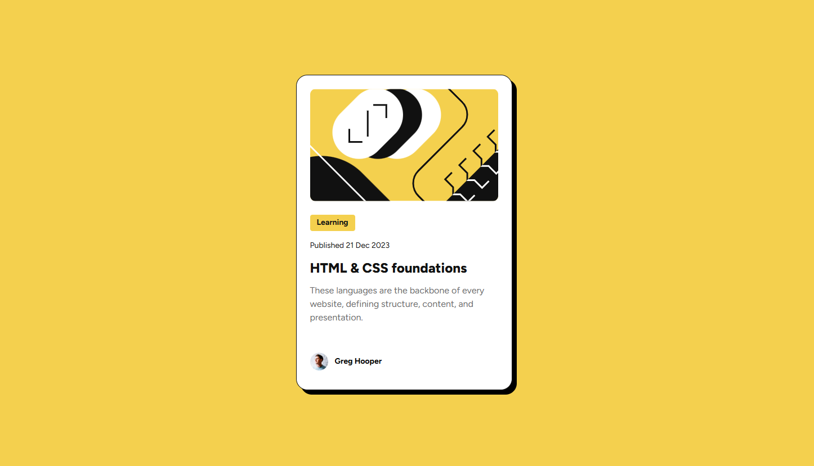
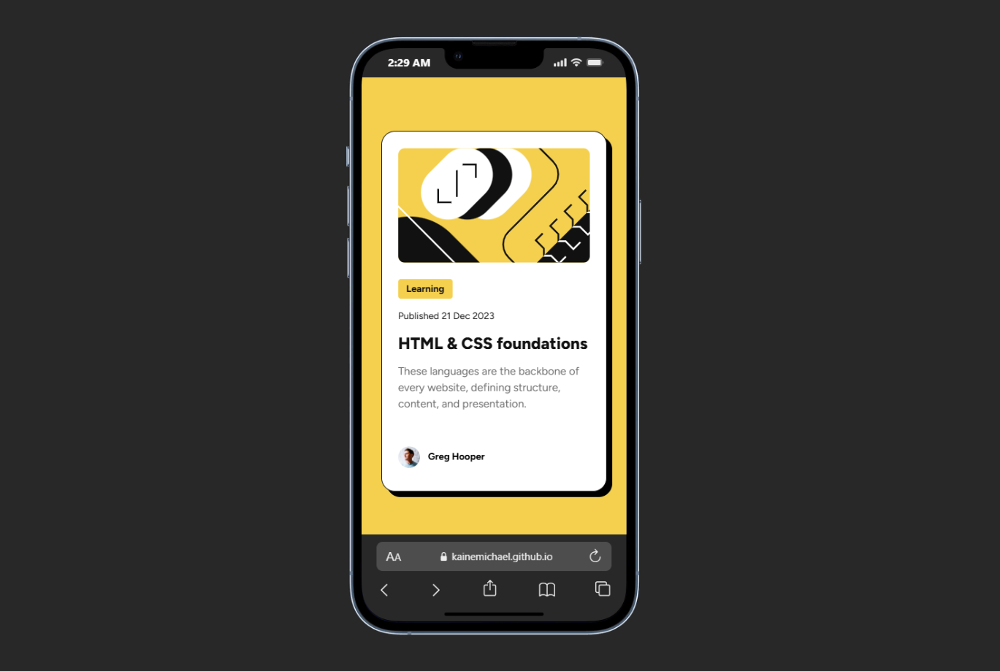

# Frontend Mentor - Blog preview card solution

This is a solution to the [Blog preview card challenge on Frontend Mentor](https://www.frontendmentor.io/challenges/blog-preview-card-ckPaj01IcS). Frontend Mentor challenges help you improve your coding skills by building realistic projects. 

## Table of contents

- [Overview](#overview)
  - [The challenge](#the-challenge)
  - [Screenshot](#screenshot)
  - [Links](#links)
- [My process](#my-process)
  - [Built with](#built-with)
  - [What I learned](#what-i-learned)
  - [Continued development](#continued-development)
  - [Useful resources](#useful-resources)
  - [AI Collaboration](#ai-collaboration)
- [Author](#author)
- [Acknowledgments](#acknowledgments)

## Overview

### The challenge

The challenge was to build the blog preview can and users will be able to hover on the heading.


### Screenshot





### Links

- Solution URL: [Solution URL here](https://github.com/kainemichael/Blog-preview-card)
- Live Site URL: [Live site URL](https://kainemichael.github.io/Blog-preview-card/)

## My process

### Built with

- Semantic HTML5 markup
- CSS Variables
- Flexbox
- Media queries.

### What I learned

I was able to import font from local folders, also i need to add a display property to pretty much everything. I was able to learn media queries for responsiveness.

```css
@font-face {
    font-family: 'Figtree';
    src: url('../fonts/Figtree-VariableFont_wght.ttf') format('truetype');
    font-weight: 100 900;  /* Variable font weight range */
    font-style: normal;
}

@media screen and (max-width: 768px) {
    body{
        padding: var(--spacing-150);
    }
    .card {
        max-width: 90%; /* Adjust width to 90% of the viewport */
    }
}
```

### Continued development

Want to be able to write more DRY codes and also be able to figure out a problem and solve it effectively.


### AI Collaboration

I made use of GitHub Copilot for brainsstorming solutions, writing shorthand properties & values and debugging. I was able to figure quite alot of things.


## Author

- Website - [Michael](https://github.com/kainemichael)
- Frontend Mentor - [@kainemichael](https://www.frontendmentor.io/profile/kainemichael)
